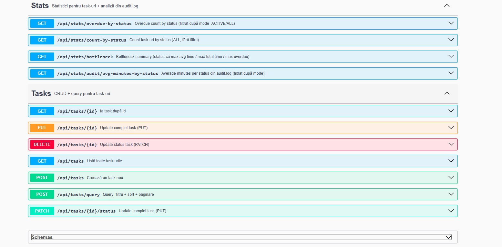

# Task Manager API (Spring Boot)

A backend REST API for managing tasks built with *Java and Spring Boot*.
The project demonstrates a clean layered architecture, DTO usage, validation, undo/redo functionality, advanced querying and automated tests.

---

# Swagger UI

The API documentation is automatically generated using *OpenAPI / Swagger*.

Run the project and access:

http://localhost:8080/swagger-ui/index.html

---

# Features

* Full CRUD operations for tasks
* Change task status (TODO / IN_PROGRESS / DONE / BLOCKED)
* Undo / Redo operations
* Filtering, sorting and pagination
* Task statistics and analytics
* JSON and CSV export
* REST API with Swagger documentation
* Unit tests and integration tests

---

# Tech Stack

* Java 17
* Spring Boot
* Maven
* H2 Database (in-memory)
* OpenAPI / Swagger
* JUnit 5

=======
A backend REST API for managing tasks, built with *Java + Spring Boot*.

The project demonstrates a clean layered architecture, DTO usage, mapping, validation, undo/redo logic and automated tests.

---

# Features

* Create, update and delete tasks
* Change task status (TODO / IN_PROGRESS / DONE / BLOCKED)
* Undo / Redo operations
* Filtering and search
* Sorting and pagination
* Status analytics
* JSON and CSV export
* REST API with Swagger documentation
* Unit tests and integration tests

---

# Tech Stack

* Java 17
* Spring Boot
* Maven
* H2 Database (in-memory)
* OpenAPI / Swagger
* JUnit 5

---

# Architecture

The project follows a clean layered architecture:

Controller → Service → Repository

DTO → Mapper → Entity

Structure:
=======
The project follows a *clean layered architecture*:

src/main/java
api → REST controllers
service → business logic
model → domain models
<<<<<<< HEAD
storage → persistence layer
=======
storage → repositories and persistence

mapper → entity to DTO mapping
config → Spring configuration

---

# API Endpoints

<<<<<<< HEAD
Tasks

GET /api/tasks
GET /api/tasks/{id}
=======
## Get all tasks

GET /api/tasks

## Get task by id

GET /api/tasks/{id}

## Create task

POST /api/tasks

## Update task

PUT /api/tasks/{id}

## Update status

PATCH /api/tasks/{id}/status

## Delete task

DELETE /api/tasks/{id}
<<<<<<< HEAD
POST /api/tasks/query

Stats

GET /api/stats/count-by-status
GET /api/stats/overdue-by-status
GET /api/stats/bottleneck
GET /api/stats/audit/avg-minutes-by-status

---

# Example Request

POST /api/tasks

{
"title": "Finish project",
"description": "Complete the task manager API",
"priority": 3,
"deadline": "2026-04-01",
"status": "TODO",
"estimatedMinutes": 120
}

---

# Running the project

Clone the repository

git clone https://github.com/Kutaba-Victor-30127/task-manager-java.git

Run the application

mvn spring-boot:run

Swagger UI

http://localhost:8080/swagger-ui/index.html

---

# Running tests

mvn test

The project contains:

* Unit tests
* Integration tests

---

# Author
=======

## Query tasks

POST /api/tasks/query

---

# Example Request

POST /api/tasks

{
  "title": "Finish project",
  "description": "Complete the task manager API",
  "priority": 3,
  "deadline": "2026-04-01",
  "status": "TODO",
  "estimatedMinutes": 120
}

---

# Running the project

Clone repository

git clone https://github.com/Kutaba-Victor-30127/task-manager-java.git

Run application

mvn spring-boot:run

Swagger UI

http://localhost:8080/swagger-ui.html

---

# Testing

Run tests

mvn test

The project contains:

* Unit tests
* Integration tests

---

# Author

Victor Kutaba
